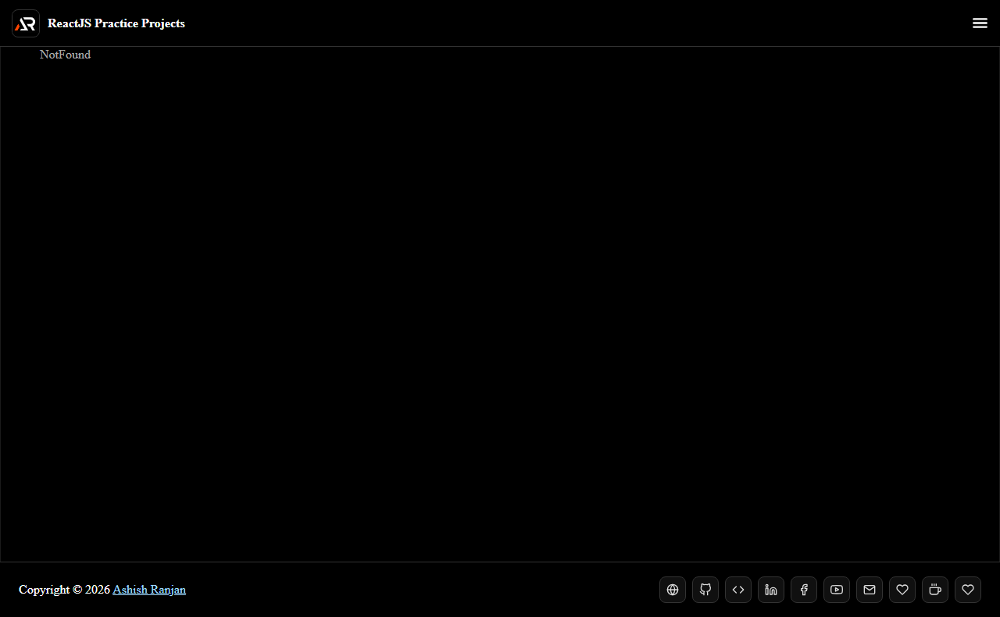

# ReactJS Practice Projects

A collection of practical React projects and frontend experiments in one Vite application. Use the project menu to explore utilities, visual demos, forms, games, API examples, and interactive components.

## Features

- Lazy-loaded project routes
- Small apps for UI, APIs, forms, games, data tools, and visual experiments
- Fixed responsive header with project navigation
- Icon-only external and support links in the footer
- Scroll-to-top control and GitHub Pages deployment

## Tech stack

React, Vite, React Router, styled-components, Material UI, React Icons, and selected focused utilities.

## Run locally

~~~bash
npm install
npm run dev
~~~

Build and deploy:

~~~bash
npm run build
npm run deploy
~~~

## Links

- Live: [https://a2rp.github.io/reactjs-practice-projects/](https://a2rp.github.io/reactjs-practice-projects/)
- Repository: [https://github.com/a2rp/reactjs-practice-projects](https://github.com/a2rp/reactjs-practice-projects)
- Portfolio: [https://www.ashishranjan.net/](https://www.ashishranjan.net/)
- GitHub: [https://github.com/a2rp](https://github.com/a2rp)
- CodePen: [https://codepen.io/ash1198](https://codepen.io/ash1198)
- LinkedIn: [https://www.linkedin.com/in/aashishranjan](https://www.linkedin.com/in/aashishranjan)
- Facebook: [https://www.facebook.com/theash.ashish/](https://www.facebook.com/theash.ashish/)
- YouTube: [https://www.youtube.com/@ashishranjan-ashz?sub_confirmation=1](https://www.youtube.com/@ashishranjan-ashz?sub_confirmation=1)
- Email: [ash.ranjan09@gmail.com](mailto:ash.ranjan09@gmail.com)

## Support

- [Support](https://a2rp-donation-page.netlify.app/)
- [Buy Me a Coffee](https://buymeacoffee.com/a2rp)
- [Patreon](https://patreon.com/a2rp)
